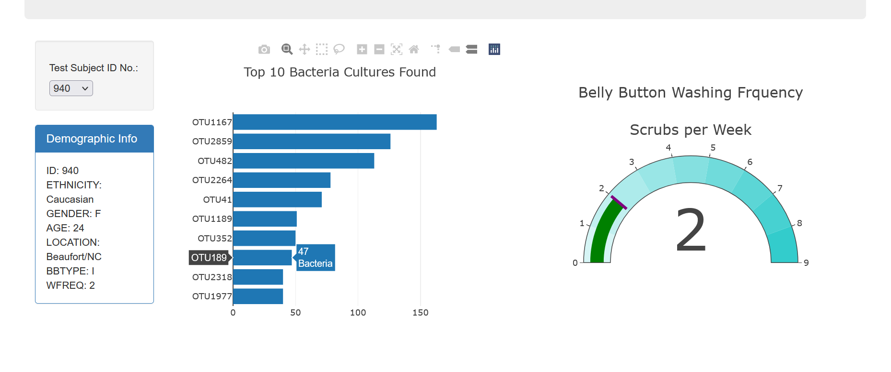
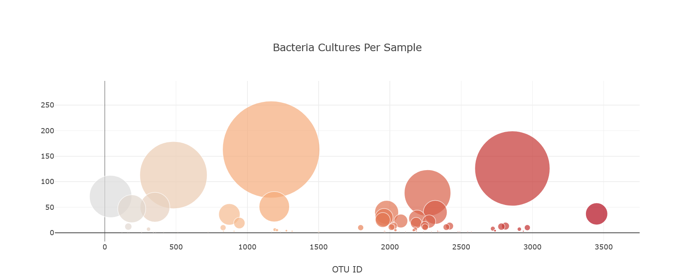

# plotly-challenge
This project contains an interactive dashboard to explore the Belly Button Biodiversity dataset, which catalogs the microbes that colonize human navels. The dataset reveals that a small handful of microbial species (also called operational taxonomic units, or OTUs, in the study) were present in more than 70% of people, while the rest were relatively rare.  

The dashboard is deployed at https://sherintm.github.io/plotly-challenge/

It has the following information for the individual selected from the dropdown.
<ul>
<li>Demographic information of the selected individual</li>
<li>Horizontal bar chart to display the top 10 OTUs found in that individual.</li>
<li>Bubble chart to show the sample information.</li>
<li>Gauge chart to plot the weekly washing frequency of the individual.</li>
</ul>

Dashboard looks as following for a selected individual:

